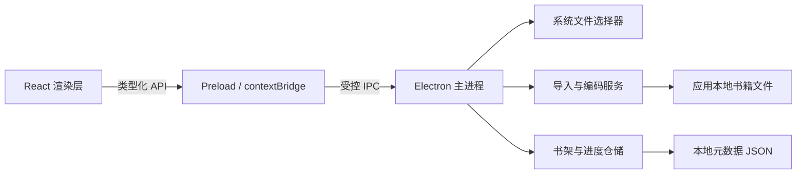

# 墨读本地电子书阅读器技术方案

- 方案版本：v0.3
- 产品阶段：持续迭代
- 更新日期：2026-09-22
- 依据文档：[墨读本地电子书阅读器产品设计文档](./PRODUCT_DESIGN.md)

## 1. 方案结论

应用采用 **Electron + TypeScript + React** 实现，以 Electron 主进程负责本地文件、持久化、EPUB 解析和系统能力，以安全的 preload 层暴露最小 API，以 React 渲染书架、目录和阅读界面。

首个可交付版本默认优先验证 Windows x64；业务代码和数据格式保持跨平台，后续可以在不调整核心架构的情况下补充 macOS 和 Linux 构建。

本产品不需要服务端、账号系统或云数据库。书籍正文和阅读数据全部保存在应用本地目录。

## 2. 技术目标与约束

### 2.1 技术目标

- 支持 UTF-8、GBK/GB18030 中文 TXT 的可靠导入。
- 支持 EPUB 2 / 3 未加密文字书，读取 spine、导航目录、书名和作者。
- TXT 在导入工作线程中识别常见章节标题，EPUB 目录缺失时回退到可见章节标题。
- 10～20 MB TXT 可以导入、打开和连续滚动，不因一次性创建大量 DOM 节点而卡死。
- 阅读位置以文本位置为基准恢复，调整字号后仍尽量停留在相同内容附近。
- 应用退出、异常关闭或原始 TXT / EPUB 被移动后，已导入书籍仍然可读。
- 渲染页面不能直接访问 Node.js 或任意文件系统能力。
- 架构保持简单，优先完成产品文档定义的两页 MVP。

### 2.2 不在本方案中实现

- 服务端、登录、云同步和遥测平台。
- PDF、MOBI、AZW3、全文搜索、书签和笔记。
- 插件系统、复杂领域框架或提前引入微服务式拆分。
- 为尚未确定的功能设计通用富文本模型。

## 3. 技术栈

| 领域 | 选择 | 用途与理由 |
| --- | --- | --- |
| 桌面运行时 | Electron | 提供统一 Chromium 渲染环境、Node.js 本地能力和原生文件选择器 |
| 语言 | TypeScript | 统一主进程、preload 和渲染层的数据契约 |
| UI | React | 实现书架、阅读页和可复用交互组件 |
| 构建 | Vite | 提供 TypeScript/React 构建和开发时热更新 |
| 打包 | Electron Forge | 生成桌面应用和 Windows 安装包，后续承接签名与发布 |
| 编码转换 | `iconv-lite` | 解码 GBK/GB18030，UTF-8 优先使用平台严格解码能力 |
| EPUB 解析 | `yauzl` + `@xmldom/xmldom` | 有界读取 ZIP，解析 OPF、EPUB 3 Navigation 与 EPUB 2 NCX |
| 长列表 | `@tanstack/react-virtual` | 只渲染视口附近的正文块，控制 DOM 数量 |
| 元数据存储 | 本地 JSON + 原子写入 | MVP 数据量小，避免过早引入原生 SQLite 依赖 |
| 单元/集成测试 | Vitest | 测试编码、进度计算、存储和业务服务 |
| 端到端测试 | Playwright Electron | 验证导入、阅读、重启恢复和移除流程 |

依赖使用锁文件固定具体版本。Electron Forge 的 Vite 插件若在开发期出现兼容性问题，可切换到 Forge 的 Webpack TypeScript 模板；该变化只影响构建层，不改变进程边界和业务模块。

## 4. 总体架构



### 4.1 主进程

主进程拥有系统权限，负责：

- 创建和管理应用窗口。
- 打开系统 TXT / EPUB 文件选择器。
- 校验文件类型、大小并读取原始字节。
- 识别/转换编码，解析 EPUB 元数据与目录，计算内容哈希并写入应用本地副本。
- 读取书架、正文、章节目录、阅读进度和字号设置。
- 原子保存元数据，移除应用内部书籍副本。
- 注册白名单 IPC，并校验消息来源和输入参数。

TXT 导入过程中的解码、哈希、文本规范化和章节识别放入 Node.js Worker，避免对较大文件的 CPU 处理阻塞 Electron 主进程事件循环。EPUB 在主进程中以数量、单文件大小和累计解压大小均受限的方式读取，不把压缩包解压到文件系统。

### 4.2 Preload

Preload 是渲染层与主进程之间的唯一桥梁。它通过 `contextBridge` 暴露具体、窄化且有 TypeScript 类型的函数，不直接暴露 `ipcRenderer`、文件路径操作或 Node.js 模块。

建议的渲染层 API：

```ts
interface ReaderDesktopApi {
  listBooks(): Promise<BookSummary[]>;
  importBook(): Promise<ImportBookResult>;
  loadBook(bookId: string): Promise<BookContent>;
  removeBook(bookId: string): Promise<void>;
  saveProgress(input: SaveProgressInput): Promise<void>;
  getSettings(): Promise<ReaderSettings>;
  updateSettings(input: Partial<ReaderSettings>): Promise<ReaderSettings>;
}
```

### 4.3 渲染层

渲染层只负责显示和交互：

- `BookshelfPage`：书籍列表、导入入口、继续阅读、移除确认。
- `ReaderPage`：虚拟化正文、目录侧栏、章节跳转、字号切换、进度展示、返回书架。
- UI 状态只保存当前页面、当前书籍和短生命周期加载状态。
- 持久化状态始终通过 preload API 交给主进程，避免形成两套数据源。

MVP 只有两个页面，不引入复杂路由和全局状态框架；React 内置状态与少量 Context 足够。

## 5. 本地数据设计

### 5.1 目录布局

所有内部数据位于 Electron `app.getPath('userData')` 返回的目录下：

```text
<userData>/
├── library.json
└── books/
    ├── <book-id>.txt
    └── <book-id>.txt
```

- 导入成功后，将解码后的正文统一保存为 UTF-8。
- `book-id` 使用规范化正文的 SHA-256 哈希，既可作为稳定标识，也可用于重复导入判断。
- `library.json` 只保存元数据、阅读位置和设置，不保存大段正文。
- 删除书籍时只允许删除 `books` 目录中由应用管理的文件，永远不操作用户选择的原始路径。

### 5.2 数据模型

```ts
interface LibraryFile {
  schemaVersion: 2;
  books: BookRecord[];
  settings: ReaderSettings;
}

interface BookRecord {
  id: string;
  title: string;
  sourceFileName: string;
  byteLength: number;
  characterLength: number;
  importedAt: string;
  lastReadAt: string | null;
  author: string | null;
  chapters: Array<{
    title: string;
    charOffset: number;
  }>;
  progress: {
    charOffset: number;
    percentage: number;
    updatedAt: string | null;
  };
}

interface ReaderSettings {
  fontSize: 'small' | 'medium' | 'large';
}
```

`library.json` 更新采用“写临时文件 → 刷新并关闭 → 同目录替换”的原子写入方式。滚动中的进度更新先在内存中节流，再以短延迟合并写盘；返回书架和应用退出前执行立即保存。

`schemaVersion` 和单一仓储接口用于数据升级。版本 2 在读取版本 1 数据时自动补充空作者和空目录，并以原子写入方式完成迁移，保留已有书籍和阅读进度。
再次导入相同内容时，如果旧记录缺少作者或目录，则只补全元数据并保留原阅读进度；元数据没有变化时仍返回重复状态。

## 6. 核心流程

### 6.1 导入 TXT / EPUB

1. 主进程打开只允许 `.txt` 与 `.epub` 的系统文件选择器。
2. 校验文件存在、扩展名、非空和大小，原始文件上限为 50 MiB。
3. TXT 在工作线程中按 UTF-8 BOM → 严格 UTF-8 → GB18030 顺序解码，统一换行、校验文字并识别章节标题。
4. EPUB 校验 ZIP、mimetype 与 container，读取 OPF manifest 和 spine，拒绝加密、路径越界或超过资源限制的内容。
5. EPUB 3 读取 Navigation Document，EPUB 2 读取 NCX；目录不可用时使用各 spine 文档的首个可见标题。
6. 两种格式都生成规范化纯文本、章节字符位置及 SHA-256 内容标识。
7. 根据内容标识检查重复记录，先写入 UTF-8 书籍副本，再原子更新 `library.json`。
8. 返回成功、重复、空文件、过大、无效 EPUB、无法解析或存储失败等明确结果。

GB18030 覆盖 GBK 常用字符范围，因此只需维护一个中文回退解码器。首版不增加编码选择界面；如果真实样本证明自动策略不足，再补充手动选择编码。

### 6.2 加载与渲染长文本

1. 渲染层根据 `bookId` 请求正文，主进程只从应用内部 `books` 目录读取。
2. 正文按段落切分；超长段落继续按约 2,000～4,000 个字符拆分。
3. 每个正文块记录起止字符偏移量。
4. 虚拟列表仅挂载视口附近的正文块，并动态测量换行后的实际高度。
5. 加载完成后，根据保存的 `charOffset` 定位对应正文块，再做块内近似定位。

20 MB 正文允许以字符串保存在渲染进程内存中，但不允许一次性渲染为成千上万个 DOM 节点。如果端到端性能测试仍出现明显停顿，再将正文传输升级为按块读取，而不是在 MVP 首轮直接增加分块文件协议。

### 6.3 阅读进度

- 进度锚点使用视口顶部正文对应的 `charOffset`，百分比仅用于书架展示。
- 百分比计算为 `charOffset / characterLength`，限制在 0～100%。
- 滚动监听按约 200～300 ms 节流，磁盘写入按约 800～1,000 ms 合并。
- 返回书架、关闭窗口和应用退出前立即刷新待保存进度。
- 调整字号前记录当前字符偏移量，虚拟列表重新测量后再恢复该位置。
- 若文件或数据损坏导致偏移量越界，将其收敛到有效范围，不能让阅读页崩溃。
- 目录项保存章节起始 `charOffset`；点击目录后复用同一定位与进度保存机制。

### 6.4 移除书籍

1. UI 显示确认提示。
2. 主进程校验 `bookId`，解析出的目标路径必须位于应用内部 `books` 目录。
3. 删除内部 UTF-8 副本并从书架元数据移除记录。
4. 不读取、不修改也不删除用户的原始 TXT / EPUB 文件。
5. 若内部副本已不存在，仍清理元数据并给出可理解的结果，保证操作幂等。

## 7. IPC 与错误处理

IPC 使用固定通道，每个通道只对应一个业务操作：

| 通道 | 方向 | 说明 |
| --- | --- | --- |
| `books:list` | renderer → main | 获取按最后阅读时间排序的书架 |
| `books:import` | renderer → main | 打开选择器并导入一本 TXT / EPUB |
| `books:load` | renderer → main | 读取指定内部书籍正文 |
| `books:remove` | renderer → main | 移除内部副本和元数据 |
| `progress:save` | renderer → main | 保存字符偏移量和百分比 |
| `settings:get` | renderer → main | 获取字号设置 |
| `settings:update` | renderer → main | 更新字号设置 |

业务错误转换为稳定错误码，渲染层负责映射成中文提示。首版至少包含：

- `EMPTY_FILE`
- `FILE_TOO_LARGE`
- `UNSUPPORTED_OR_INVALID_TEXT`
- `DUPLICATE_BOOK`
- `BOOK_NOT_FOUND`
- `STORAGE_UNAVAILABLE`
- `UNKNOWN_ERROR`

日志只记录错误类型、调用位置和必要的技术信息，不记录书籍正文。文件路径在用户界面和可导出日志中应做最小化展示。

## 8. 安全边界

Electron 窗口必须采用以下基线：

- `nodeIntegration: false`
- `contextIsolation: true`
- `sandbox: true`
- 只加载应用打包后的本地资源，不加载或执行远程代码。
- 配置限制性 Content Security Policy。
- 禁止未知页面导航和新窗口创建。
- IPC 处理器验证发送方、`bookId`、数值范围和对象结构。
- preload 只暴露业务函数，不暴露通用 `send`、文件系统或 shell API。
- 书籍正文始终按纯文本渲染，不使用 `innerHTML`。
- 保持 Electron 在受支持的稳定版本，并定期安装安全更新。

## 9. 测试与验证

### 9.1 单元测试

- UTF-8 BOM、无 BOM UTF-8、GBK/GB18030 中文样本解码。
- 空文件、乱码倾向内容、超限文件和异常控制字符处理。
- 文本规范化、SHA-256 去重和重复导入判断。
- TXT 常见章节标题、EPUB 2 NCX、EPUB 3 Navigation、作者及回退标题解析。
- `charOffset` 与百分比计算、边界收敛和字号变化锚点。
- 书架排序、JSON 序列化和 schemaVersion 校验。

### 9.2 集成测试

- 使用临时 `userData` 目录验证导入、内部复制和重启后重新加载。
- 验证原子写入失败时旧元数据仍可读取。
- 验证 schemaVersion 1 自动迁移到版本 2 且保留阅读进度。
- 验证删除操作只能命中应用内部文件。
- 验证所有 IPC 参数校验和错误码映射。

### 9.3 端到端测试

- 导入 UTF-8 TXT 后立即进入阅读。
- 导入 GBK/GB18030 TXT 后中文显示正确。
- 导入 EPUB 后展示作者和目录，并能跳转到目标章节。
- 重复导入同一本书时出现提示且书架不新增记录。
- 阅读、关闭并重新启动应用后恢复到相同文本附近。
- 调整大、中、小字号后仍停留在相同文本附近。
- 移除书籍后书架记录和内部副本消失，原始 TXT / EPUB 仍存在。
- 用自动生成的 10 MB 和 20 MB 文本验证导入耗时、首次可读时间和连续滚动。

### 9.4 建议性能门槛

以下指标作为开发验收基线，并在固定测试机器上记录实际结果：

- 20 MB TXT 导入期间窗口仍能响应移动和重绘。
- 打开已导入的 20 MB 书籍后，正文在 2 秒内达到可滚动状态。
- 正常连续滚动不出现持续性明显掉帧。
- 滚动时 DOM 正文块数量维持在虚拟列表窗口范围内，不随全书长度线性增长。

## 10. 构建与交付

- 开发模式由 Vite 启动渲染层，Electron Forge 管理主进程启动。
- CI 至少执行类型检查、Lint、Vitest、文档校验和 Playwright 核心流程。
- 当前生成 Windows x64 安装包和免安装测试包。
- 正式公开分发前配置 Windows 代码签名；macOS 发布时另行配置签名和 notarization。
- Windows 安装版的自动更新通过 GitHub Releases 和 update.electronjs.org 检查、下载，并在下次启动应用时生效。
- 构建产物不打包测试样本、源映射或用户书籍数据。

## 11. 实施顺序

### 阶段一：桌面骨架与存储

- 初始化 Electron、TypeScript、React 和构建链。
- 建立 main/preload/renderer 边界和类型化 IPC。
- 实现书架仓储、内部文件目录和原子写入。

### 阶段二：导入与书架闭环

- 实现文件选择、编码转换、去重和内部复制。
- 实现书架展示、排序、错误提示和移除。
- 完成编码及存储单元/集成测试。

### 阶段三：阅读与进度闭环

- 实现正文分块和虚拟滚动。
- 实现字符偏移量进度、字号调整和恢复。
- 完成重启恢复与长文本端到端测试。

### 阶段四：交付加固

- 完成安全基线检查、异常场景和性能测试。
- 生成 Windows 安装包并执行干净环境验收。
- 对照产品文档逐项完成最终验收。

### 阶段五：EPUB 与统一目录

- 解析 EPUB 2 / 3 导航、作者和章节正文，并在目录缺失时安全回退。
- 在 TXT 工作线程中识别常见章节标题。
- 将书库迁移到 schemaVersion 2，并在阅读页提供统一目录侧栏与章节跳转。

## 12. 主要风险与应对

| 风险 | 影响 | 应对 |
| --- | --- | --- |
| 中文编码误判 | 正文乱码 | 使用确定性 UTF-8 优先策略、GB18030 回退和真实样本测试 |
| 整书 DOM 渲染 | 打开或滚动卡顿 | 正文分块、虚拟列表和 20 MB 性能用例 |
| 字号改变导致位置漂移 | 恢复体验不可靠 | 保存字符偏移量，不依赖纯滚动像素 |
| 频繁写入损坏元数据 | 书架或进度丢失 | 节流、原子替换和故障注入测试 |
| Electron 包体和内存较大 | 影响下载和低配设备体验 | MVP 先验证产品；以实测数据决定是否评估 Tauri |
| Electron/构建依赖升级 | 构建或安全风险 | 锁定版本、自动化验证并按周期升级 |

## 13. 后续演进边界

- 加入全文搜索、笔记或大量元数据后，可保持仓储接口不变并将 JSON 迁移到 SQLite。
- 加入 PDF 等固定版式格式时使用独立渲染适配层；TXT 与 EPUB 继续共用纯文本副本、章节字符位置和阅读进度模型。
- 云同步只有在产品明确引入账号体系后再设计；当前数据模型不承诺跨设备冲突解决。
- 若实测证明 Electron 的包体、启动速度或内存无法接受，再以同一 React 界面和业务契约评估迁移 Tauri，避免仅凭理论指标提前改换技术栈。

## 14. 参考资料

- [Electron Process Model](https://www.electronjs.org/docs/latest/tutorial/process-model)
- [Electron Security](https://www.electronjs.org/docs/latest/tutorial/security)
- [Electron dialog API](https://www.electronjs.org/docs/latest/api/dialog)
- [Electron Forge](https://www.electronforge.io/)
- [TanStack Virtual](https://tanstack.com/virtual/latest)
